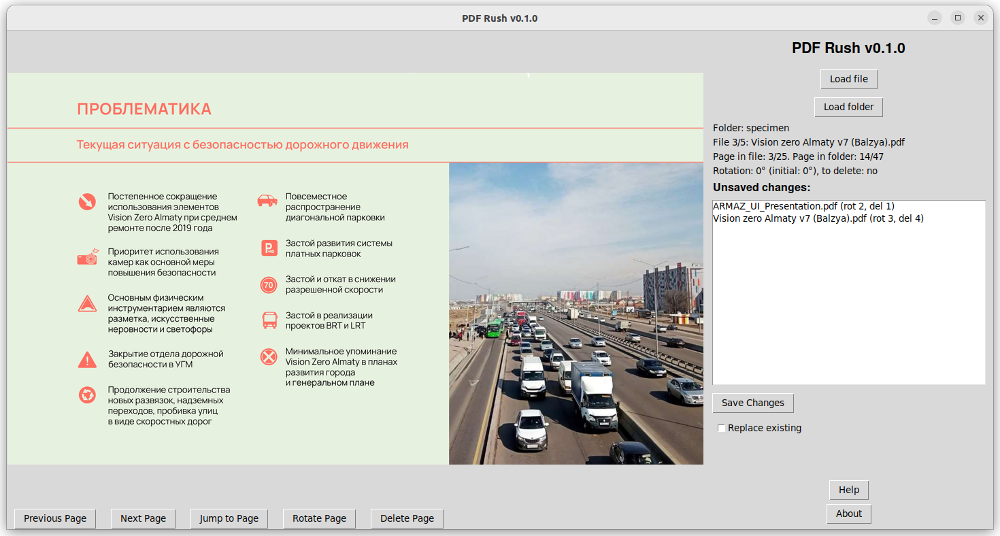

# PDF Rush

PDF Rush is a simple PDF editor application built with Python, PyPDF2 and Tkinter.

The name _PDF Rush_ reflects the very essence of the app: perform basic PDFs manipulation at high speed.

I was tired of watching my wife suffer through the vicious cycle of 'opening countless PDFs one by one, waiting for them to load in a heavy PDF editor, clicking on numerous buttons and menus just to rotate and delete pages, saving, and then closing the PDF'. I leveraged ChatGPT to facilitate the coding process and bring PDF Rush to life more quickly.



## Features

- View and edit multiple PDF files in a single interface
- Rotate pages to adjust the orientation
- Delete specific pages from PDF files
- Convinient key bindings
- Save edited files with the option to replace the original or create a new output folder

## Use cases

- **Fast Batch Processing**: PDF Rush provides a quick and efficient way to process multiple PDF files in a folder simultaneously, saving time and effort.

- **Quick Fix for Scanning Errors**: PDF Rush helps users correct scanning errors, such as pages scanned upside down or blank pages, without the need for complex software.

- **Quickly Rotate Pages in Scanned Documents**: Users can easily rotate pages in scanned documents that might have been scanned in the wrong orientation.

- **Remove Unwanted Pages**: Users can delete unnecessary pages from PDF files, such as blank pages or pages with confidential information.

- **Optimize PDF File Size**: Users can remove pages or rotate them to optimize the file size of PDFs, making them easier to share or store.

- **Archive and Sort Documents**: Users can edit and organize important documents for archiving purposes, ensuring they are correctly aligned and contain only relevant pages.

## Getting Started

### Portable/bundle version

If you don't have Python installed or prefer not to install extra software, we provide ready-to-use binaries in a portable/bundle version. These binaries allow you to launch the app directly without any additional setup, making it easy to use and share.

### Launch directly with Python

As this app is written in Python, you also have the option to launch it directly from the source code. This gives you the flexibility to customize and explore the app further using Python, and is particularly useful for developers or users who are familiar with the Python environment.

#### Prerequisites

Make sure you have Python 3.x installed on your system. You can download Python from the official website: <https://www.python.org/downloads/>

#### Installation

```bash
git clone https://github.com/TimurRin/pdf-rush.git
cd pdf-rush
pip install -r requirements.txt
python pdf-rush.py
```

## App usage

1. Click on the "Load Folder" button to select a folder containing PDF files. The application will load all PDF files from the selected folder and display the first page of the first file.

2. Use the navigation buttons to switch between pages and the "Rotate Page" and "Delete Page" buttons to make edits. Key bindings also available ("Help" button)

3. Click on the "Save Changes" button to save the edited pages. You can choose to replace the original files or save the edited files in a new output folder (a folder named '_pdf_rush' will be created in current working directory).

## Changelog

We curate the human-readable changelog. You can find it in the [CHANGELOG.md](CHANGELOG.md) file.

## License

This project is licensed under the **BSD 3-Clause License**, see the [LICENSE](LICENSE) file for details.

## Contributing

Contributions are welcome! If you find any issues or have suggestions for improvements, feel free to open an issue or create a pull request.

## Authors

- Timur Moziev ([@TimurRin](https://github.com/TimurRin)) (idea, development)
- Maria Zhizhina (testing)
